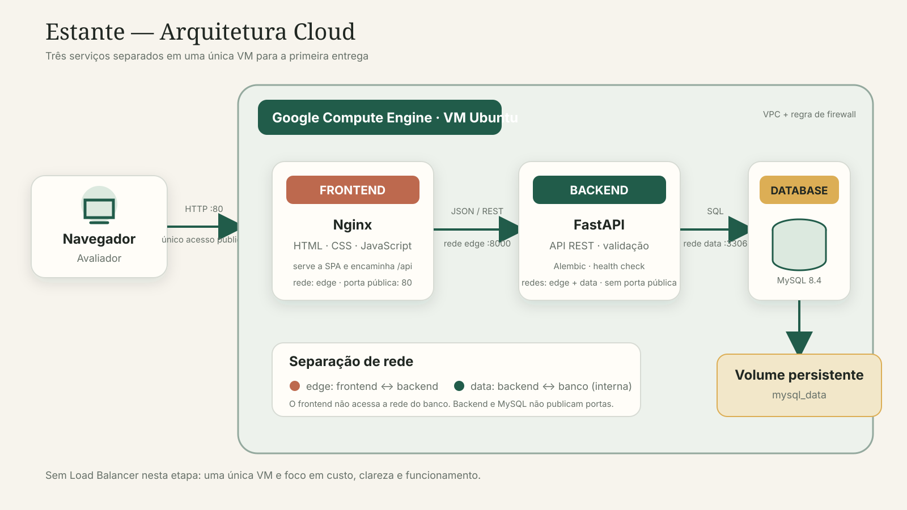

# Documento técnico de arquitetura

## 1. Visão geral

O Estante utiliza uma arquitetura Web em três camadas. Frontend, backend e
banco de dados são componentes separados, cada um executado em seu próprio
container. Na primeira entrega, os containers podem compartilhar uma única VM
do Google Compute Engine para reduzir custo e complexidade operacional.

## 2. Componentes e justificativas

| Componente | Tecnologia | Responsabilidade | Justificativa |
|---|---|---|---|
| Cloud | Google Cloud Platform | hospedar a infraestrutura | interface conhecida pelo grupo, VM configurável e suficiente para a primeira entrega |
| Computação | Compute Engine, uma VM Ubuntu | executar Docker e os três containers | custo e complexidade menores que Kubernetes para uma aplicação acadêmica pequena |
| Entrada Web | Nginx no container `frontend` | servir HTML/CSS/JS e encaminhar `/api` | leve, estável e mantém apenas uma porta pública |
| Frontend | HTML, CSS e JavaScript | interface responsiva e consumo REST | não exige build pesado e funciona em qualquer navegador moderno |
| Backend | FastAPI/Python no container `backend` | regras, validação e API REST | implementação enxuta, documentação OpenAPI automática e baixo consumo |
| Banco | MySQL 8.4 no container `database` | armazenar livros | versão LTS, banco relacional conhecido pela equipe e com restrições de integridade |
| Persistência | volume Docker `mysql_data` | manter os arquivos do MySQL | os dados sobrevivem a recriações e reinícios de containers |
| Rede | redes Docker `edge` e `data` | limitar comunicação entre camadas | frontend não acessa o banco; MySQL não fica exposto à Internet |
| Evolução do schema | Alembic | versionar estrutura do banco | torna mudanças reproduzíveis e auditáveis |

## 3. Fluxo de comunicação

1. O avaliador acessa o IP ou domínio da VM pelo navegador na porta 80.
2. A regra de firewall da VPC permite HTTP para a VM.
3. O Nginx do frontend entrega os arquivos estáticos.
4. Requisições para `/api/*` são encaminhadas ao backend na rede `edge`.
5. O backend valida a requisição e acessa o MySQL pela rede interna `data`.
6. O MySQL grava os dados no volume persistente e devolve o resultado.
7. A resposta JSON retorna pelo backend e pelo Nginx até o navegador.

## 4. Separação dos serviços

- `frontend`: participa somente da rede `edge` e publica a porta 80;
- `backend`: participa das redes `edge` e `data`, mas usa apenas `expose: 8000`;
- `database`: participa somente da rede interna `data`, sem `ports` públicos;
- somente o backend possui a URL e as credenciais de conexão do banco.

Essa separação permite atualizar cada camada de forma independente e evita
acesso direto do navegador ao MySQL.

## 5. Balanceamento de carga

Não há balanceador nesta primeira entrega. Existe apenas uma VM e uma instância
de cada container, portanto um balanceador aumentaria custo sem oferecer alta
disponibilidade real. O Nginx atua como servidor Web e proxy reverso, não como
um balanceador Cloud gerenciado.

## 6. Segurança

Medidas implementadas:

- somente o frontend publica uma porta;
- backend e banco usam redes Docker privadas;
- senha do banco fica em `.env`, que não é versionado;
- usuário da aplicação é separado do usuário administrativo `root`;
- backend executa com usuário não privilegiado no container;
- validação de tamanho, valores e faixa de avaliação na API;
- restrições de unicidade e `CHECK` também no MySQL;
- headers HTTP como CSP, `X-Content-Type-Options` e proteção contra frames;
- migrations versionadas e health checks dos três serviços;
- recomendação de firewall permitindo apenas SSH restrito e HTTP/HTTPS.

Antes de uso real, o grupo deve configurar HTTPS com certificado válido,
restringir SSH a IPs autorizados, trocar a senha de exemplo e aplicar
atualizações de segurança na VM.

## 7. Benefícios

- implantação reproduzível com um único `docker compose up`;
- camadas claramente separadas apesar de compartilharem a VM;
- baixo consumo adequado ao escopo acadêmico;
- documentação REST disponível aos avaliadores;
- dados preservados fora do ciclo de vida do container;
- possibilidade de substituir ou escalar uma camada futuramente.

## 8. Limitações e riscos

- a VM é ponto único de falha;
- o volume local não oferece alta disponibilidade;
- não há autenticação: a aplicação deve conter apenas dados de demonstração;
- HTTP sem certificado não protege o tráfego em rede;
- uma VM pequena pode ficar sem memória durante builds;
- backup, monitoração centralizada e recuperação ainda são manuais;
- não há pipeline de CI/CD, pois não faz parte desta etapa.

## 9. Melhorias futuras

1. configurar domínio e HTTPS automatizado;
2. adicionar autenticação e autorização por usuário;
3. automatizar backups e testar restauração;
4. usar Cloud SQL para banco gerenciado quando o orçamento permitir;
5. adicionar métricas, alertas e logs centralizados;
6. implantar CI/CD na entrega final;
7. usar múltiplas instâncias e Load Balancer somente se houver necessidade real
   de disponibilidade e escala.
